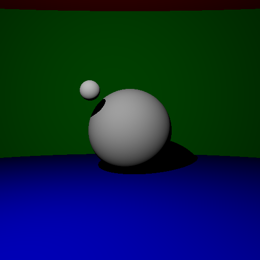
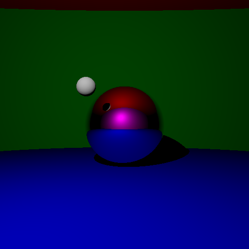

# About

This repository contains the code and report for a CS course at Ecole Centrale de Lyon.
It mainly consists in a raytracer code written from scratch in C++.

# Results

The work is incremental. Each step consists in a defined set of features working.
The code for a given step correspond to a git tag.

## Step 1: Geometry detection

## Step 2: Light diffusion

## Step 3: Multiple object handling and color handling

"Step" 3.5: refactor code about material and intersection. Add a basic invert gamma function to reduce constrast.

## Step 4: Add shadows

## Step 5: Add mirror like surfaces

## Step 6: Add transparent material

"Step" 6.5: added stocastic raytracing for partial reflexions at transparent interfaces.

## Step 7: Add indirect lighting and extended light sources

"Step" 7.5: added depht-of-field effect. A lot of noise appear, it decrease with more ray launched (seed [high resolution render](./result/highres_3.png)).

